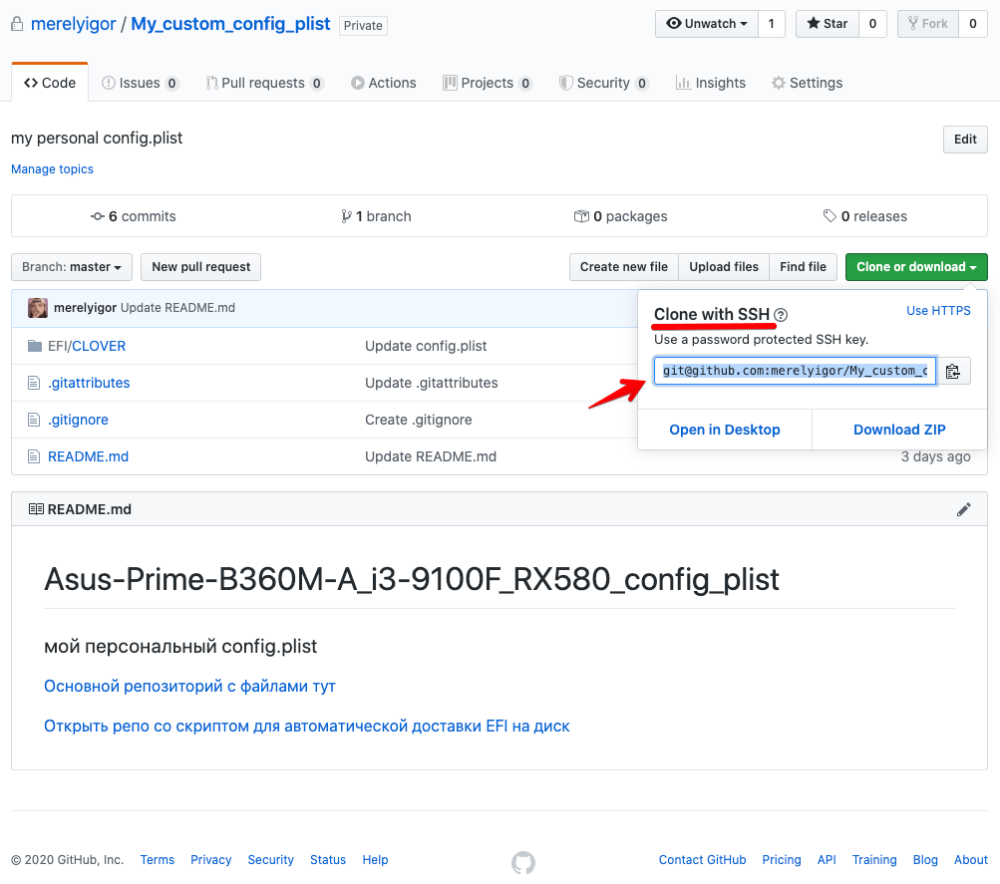
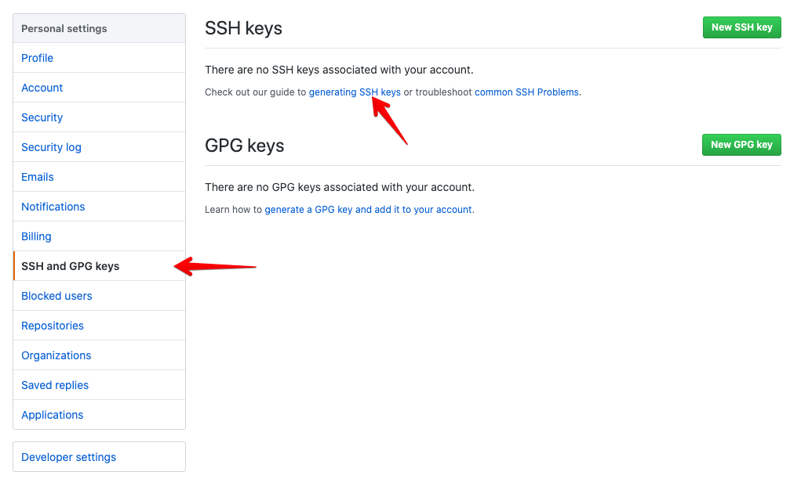

## Script-install-EFI-B360M-A_i3-9100F_RX580
```shell script
cat <<EEF
░░░░░░░░░░░░░░░░░░░░░░░░░░░░░░░░░░░░░░░░░░░░░░░░░░░░░░░░░░░░░░░░░░░░░░░░░░░░░░░░░░░░░░░░░░░░░░░░░░░░░░░
░░░░░░░░░░░░███╗░░░███╗███████╗██████╗░███████╗██╗░░██╗░░░██╗░░██╗░██████╗░░█████╗░██████╗░░░░░░░░░░░░░
░░░░░░░░░░░░████╗░████║██╔════╝██╔══██╗██╔════╝██║░░╚██╗░██╔╝░░██║██╔════╝░██╔══██╗██╔══██╗░░░░░░░░░░░░
░░░░░░░░░░░░██╔████╔██║█████╗░░██████╔╝█████╗░░██║░░░╚████╔╝░░░██║██║░░██╗░██║░░██║██████╔╝░░░░░░░░░░░░
░░░░░░░░░░░░██║╚██╔╝██║██╔══╝░░██╔══██╗██╔══╝░░██║░░░░╚██╔╝░░░░██║██║░░╚██╗██║░░██║██╔══██╗░░░░░░░░░░░░
░░░░░░░░░░░░██║░╚═╝░██║███████╗██║░░██║███████╗███████╗██║░░░░░██║╚██████╔╝╚█████╔╝██║░░██║░░░░░░░░░░░░
░░░░░░░░░░░░╚═╝░░░░░╚═╝╚══════╝╚═╝░░╚═╝╚══════╝╚══════╝╚═╝░░░░░╚═╝░╚═════╝░░╚════╝░╚═╝░░╚═╝░░░░░░░░░░░░
░░░░░░░░░░░░░░░░░░░░░░░░░░░░░░░░░░░░░░░░░░░░░░░░░░░░░░░░░░░░░░░░░░░░░░░░░░░░░░░░░░░░░░░░░░░░░░░░░░░░░░░
░░░░░░░░░░░░░░░░░░░░░░░░░░░░░░░░░░░░░░░░░░███████╗███████╗██╗░░░░░░░░░░░░░░░░░░░░░░░░░░░░░░░░░░░░░░░░░░
░░░░░░░░░░░░░░░░░░░░░░░░░░░░░░░░░░░░░░░░░░██╔════╝██╔════╝██║░░░░░░░░░░░░░░░░░░░░░░░░░░░░░░░░░░░░░░░░░░
░░░░░░░░░░░░░░░░░░░░░░░░░░░░░░░░░░░░░░░░░░█████╗░░█████╗░░██║░░░░░░░░░░░░░░░░░░░░░░░░░░░░░░░░░░░░░░░░░░
░░░░░░░░░░░░░░░░░░░░░░░░░░░░░░░░░░░░░░░░░░██╔══╝░░██╔══╝░░██║░░░░░░░░░░░░░░░░░░░░░░░░░░░░░░░░░░░░░░░░░░
░░░░░░░░░░░░░░░░░░░░░░░░░░░░░░░░░░░░░░░░░░███████╗██║░░░░░██║░░░░░░░░░░░░░░░░░░░░░░░░░░░░░░░░░░░░░░░░░░
░░░░░░░░░░░░░░░░░░░░░░░░░░░░░░░░░░░░░░░░░░╚══════╝╚═╝░░░░░╚═╝░░░░░░░░░░░░░░░░░░░░░░░░░░░░░░░░░░░░░░░░░░
░░░░░░░░░░░░░░░░░░░░░░░░░░░░░░░░░░░░ Mᴏй Mᴀгичᴇᴄᴋий EFI дᴏᴄтᴀʙщиᴋ ░░░░░░░░░░░░░░░░░░░░░░░░░░░░░░░░░░░░░
EEF
```

[RUS](https://github.com/merelyigor/Script-install-EFI-B360M-A_i3-9100F_RX580/blob/master/REDME_RU.md) / ENG

[The main repository with files in EFI here](https://github.com/merelyigor/Asus-Prime-B360M-A_i3-9100F_RX580)

[Closed repo with a mine personal config](https://github.com/merelyigor/Asus-Prime-B360M-A_i3-9100F_RX580_config_plist) | only for me

[Open repo with script for automatic delivery of EFI to disk](https://github.com/merelyigor/Script-install-EFI-B360M-A_i3-9100F_RX580)

Copy to standard terminal and press Enter
```
bash -c "$(curl -fsSL https://raw.githubusercontent.com/merelyigor/Script-install-EFI-B360M-A_i3-9100F_RX580/master/run.sh)"
```

> This script was created by me in order to be able to
> automatically deliver all the necessary folders and files for my Hackintosh to work,
> the script will automatically download the desired folder to the computer and
> moves it to the EFI section which you need to mount earlier in any convenient way.
> 
> Also, the script delivers a custom config (config.plist) to the inside of the bootloader,
> since the config in the repository with the loader does not have serial numbers and
> other necessary numbers about which I can’t deal, these
> everyone should generate the data for himself, but then having his own file
> configured config you can create a repository according to the instructions below,
> following the rules of the config repository you can use the full functions
> automation with this script.
> 
> With the default config, MacOS will boot as well, but it’s not so beautiful,
> and most likely you will not be available functions: AppleID, iMessage, FaceTime


## What kind of repo with custom config ???
After the script finishes mixing the folder with the bootloader and the start config,
you will be given the opportunity to choose in which you can choose the delivery of the config from your
repository, after which the script also downloads your config from the repository and places it in the bootloader.

Keep in mind that the repository must meet the requirements described in the instructions below.

Also remember that your repo should be public or which is not desirable,
or you must generate an SSH key to be able to clone the repository using an ssh link,
in order to make sure the key works, you can clone your repository locally
on any computer by typing in the terminal `git clone git@github.com:USER-NAME/My_custom_config_plist.git` 
note that the link must be taken from the page of your repository.
 



## So how do make your own repo config.plist so that everything works smoothly ???

* You should have already configured a config (config.plist)

* You must have a registration on github.com

* You need to create a repository named (My_custom_config_plist) without brackets
note that the name is capitalized and has underscores.
<div>
    
    
</div>

* Once you have created the repository you have several ways
clone it to your computer, we need a way to get the command
`git clone link/to/perository` and using links with SSH access.


* To connect access by SSH key go to account settings


* Select the tab (SSH and GPG keys) and then click on the link
 [generating SSH keys](https://help.github.com/en/github/authenticating-to-github/connecting-to-github-with-ssh)
 


##### Generate a new SSH key
* Open Terminal.

* Paste the text below by substituting GitHub into your email address.


```$xslt
$ ssh-keygen -t rsa -b 4096 -C "your_email@example.com"
```
* This will create a new ssh key using the provided email as a label..

```$xslt
> Generating public/private rsa key pair.
```
* When you are prompted "Enter the file where you want to save the key",
press Enter. This accepts the default file location..


```$xslt
> Enter a file in which to save the key (/Users/you/.ssh/id_rsa): [Press enter]
```
* At the command prompt, enter your password. See “Working with SSH Keywords” for more information.
A password can even consist of three digits, but it’s better to come up with one that you will not forget or save it more securely.
```$xslt
> Enter passphrase (empty for no passphrase): [Type a passphrase]
> Enter same passphrase again: [Type passphrase again]
```


* After the manipulations in the terminal, you can go to your user’s folder
and see the .ssh folder there (note that the folder is hidden and you need to display it
[enable display of hidden files and folders](https://netflow.by/blog/os-tweak/706-otobrazit-skrytye-fajly-v-macos-prostoj-sposob)
this can be done by typing in the terminal 
`defaults write com.apple.finder AppleShowAllFiles TRUE ; killall Finder` or by pressing Command + Shift + . ( dot) in the finder application)


* After we made sure that the SSH files are scanned and located where necessary,
you can proceed with further configuration, go to the profile settings in the tab (SSH and GPG keys)
as we did above and now click on (New SSH key)


* Now type in terminal `cat ~/.ssh/id_rsa.pub` and you will see the output of a bunch of characters,
you just need to copy starting from the line ssh-rsa and ending with your email.


* Insert and save your key in profile settings


* check if this works, go to the page of your repository,
To do this, simply click on (Your repositories) in the profile on the top right side,
and select your repository from the list, and copy the link to your repository from the field

enter in the terminal: specify your user instead of USER or substitute your link
```$xslt
cd ~/Desktop; git clone git@github.com:USER/My_custom_config_plist.git
```
* You may need to enter a password invented when generating the key, enter and continue.


* You might get the phrase (warning: You appear to have cloned an empty repository.)
that your repo is empty it's nothing to worry about, after cloning is done if all
successfully you should see a folder on the desktop with the name (My_custom_config_plist)


* Create a folder (EFI) in the (My_custom_config_plist) folder
* Create a folder (CLOVER) in the folder (My_custom_config_plist / EFI)
* The repository structure is shown below (it is important that it matches exactly)
you can have other files and folders there, the main thing is that the structure My_custom_config_plist / EFI / CLOVER / config.plis
was anyway.


* After that we need to commit and launch changes to the remote repository in the gita, for this we need a terminal,
below, everything that starts with (#) lattice is a comment, and all that with ($ ) commands for the terminal that you need to enter without a space at the beginning.
```shell script

# follow the path of the repository on the desktop 
$ cd My_custom_config_plist/

# add new files to the index index
$ git add EFI

# we comment on adding or modifying files (instead of 'мой комит лалала', you can write anything it's just a commit signature message)
$ git commit -a -m 'мой комит лалала'

# after we commit we can push to the server in the main branch
# you may need to enter the password invented earlier for the SSH key
$ git push origin master

```

* after you start the changes on the repository page, you will see the added folders and the config file,
the folder itself can be either left on the desktop or moved or deleted altogether,
described actions you can clone your repo at any time and change the config file for example.


* Now in the script you may need to enter the SSH key password at the time of repository cloning,
just enter your password and press Enter.


* Choose option (1) Yes, I have my repo


* Substitute your link to the repository with the config by which you cloned it to your computer,
also enter the password of the SSH key


* If after that you see that (the config was moved successfully), you may be
sure that it is already in the right place and the EFI folder that I update and
I hold it now contains your custom config with your data
serial numbers and more.


### Periodic revision of scripts and their improvement for the better.

##### You can contact me through the contacts on my site [blog.eremenko.top](https://blog.eremenko.top)