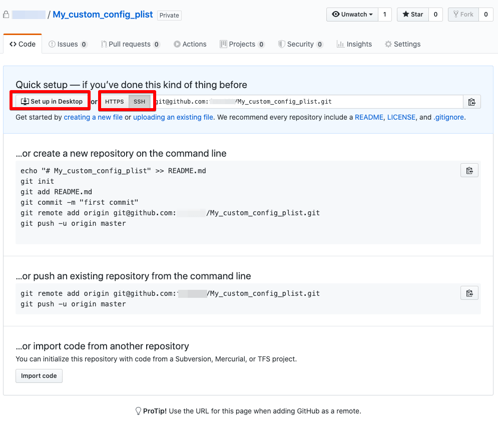
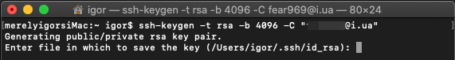
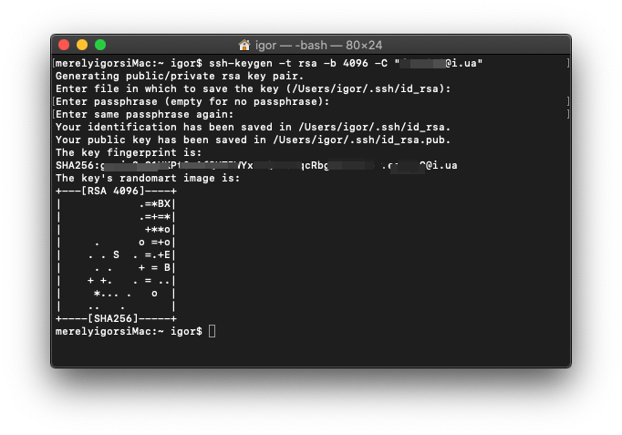
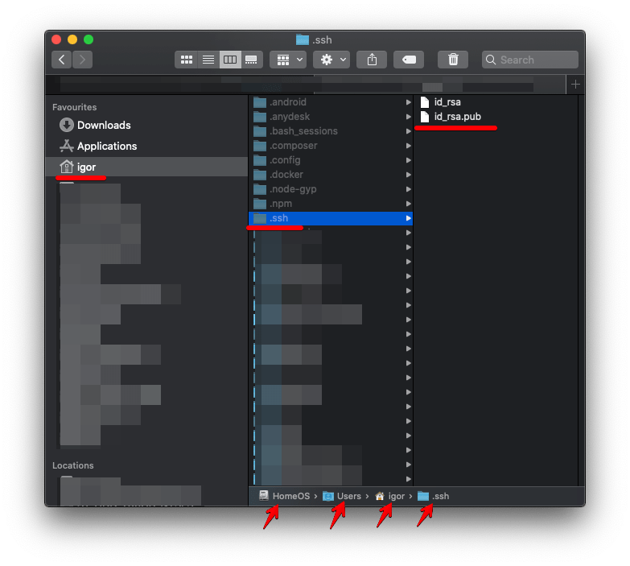
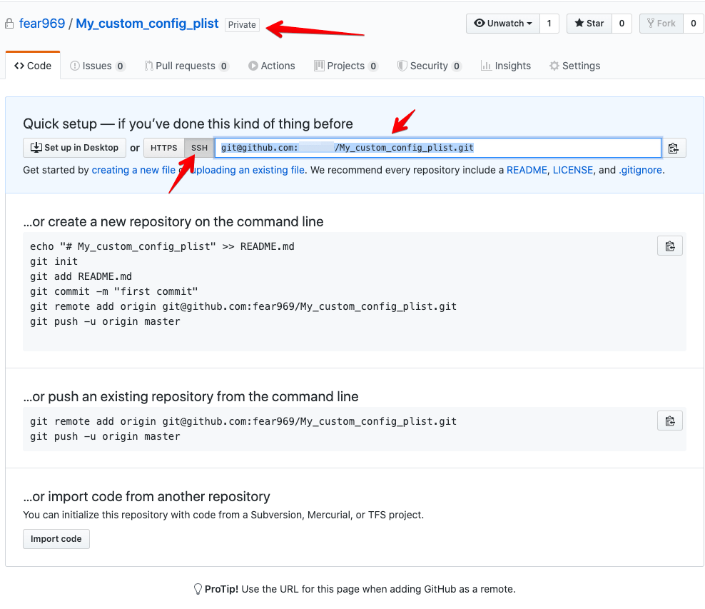
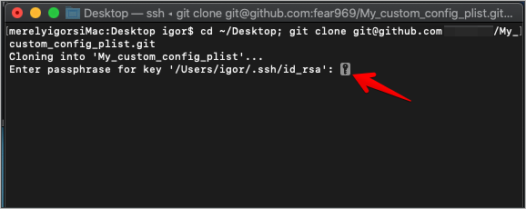
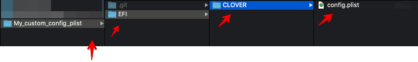
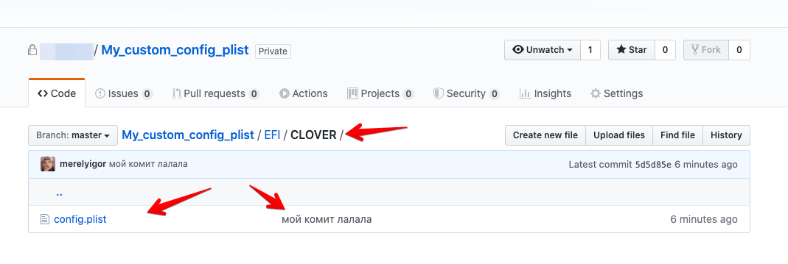
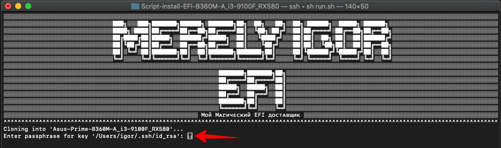
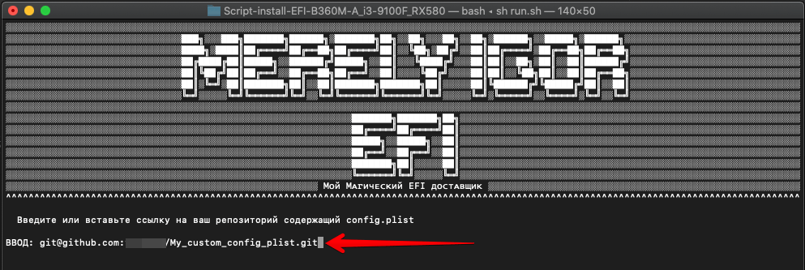

## Script-install-EFI-B360M-A_i3-9100F_RX580
```shell script
cat <<EEF
░░░░░░░░░░░░░░░░░░░░░░░░░░░░░░░░░░░░░░░░░░░░░░░░░░░░░░░░░░░░░░░░░░░░░░░░░░░░░░░░░░░░░░░░░░░░░░░░░░░░░░░░░░░░░
░░░░░░░░░░░░░░░███╗░░░███╗███████╗██████╗░███████╗██╗░░██╗░░░██╗░░██╗░██████╗░░█████╗░██████╗░░░░░░░░░░░░░░░░
░░░░░░░░░░░░░░░████╗░████║██╔════╝██╔══██╗██╔════╝██║░░╚██╗░██╔╝░░██║██╔════╝░██╔══██╗██╔══██╗░░░░░░░░░░░░░░░
░░░░░░░░░░░░░░░██╔████╔██║█████╗░░██████╔╝█████╗░░██║░░░╚████╔╝░░░██║██║░░██╗░██║░░██║██████╔╝░░░░░░░░░░░░░░░
░░░░░░░░░░░░░░░██║╚██╔╝██║██╔══╝░░██╔══██╗██╔══╝░░██║░░░░╚██╔╝░░░░██║██║░░╚██╗██║░░██║██╔══██╗░░░░░░░░░░░░░░░
░░░░░░░░░░░░░░░██║░╚═╝░██║███████╗██║░░██║███████╗███████╗██║░░░░░██║╚██████╔╝╚█████╔╝██║░░██║░░░░░░░░░░░░░░░
░░░░░░░░░░░░░░░╚═╝░░░░░╚═╝╚══════╝╚═╝░░╚═╝╚══════╝╚══════╝╚═╝░░░░░╚═╝░╚═════╝░░╚════╝░╚═╝░░╚═╝░░░░░░░░░░░░░░░
░░░░░░░░░░░░░░░░░░░░░░░░░░░░░░░░░░░░░░░░░░░░░░░░░░░░░░░░░░░░░░░░░░░░░░░░░░░░░░░░░░░░░░░░░░░░░░░░░░░░░░░░░░░░░
░░░░░░░░░░░░░░░░░░░░░░░░░░░░░░░░░░░░░░░░░░░░░███████╗███████╗██╗░░░░░░░░░░░░░░░░░░░░░░░░░░░░░░░░░░░░░░░░░░░░░
░░░░░░░░░░░░░░░░░░░░░░░░░░░░░░░░░░░░░░░░░░░░░██╔════╝██╔════╝██║░░░░░░░░░░░░░░░░░░░░░░░░░░░░░░░░░░░░░░░░░░░░░
░░░░░░░░░░░░░░░░░░░░░░░░░░░░░░░░░░░░░░░░░░░░░█████╗░░█████╗░░██║░░░░░░░░░░░░░░░░░░░░░░░░░░░░░░░░░░░░░░░░░░░░░
░░░░░░░░░░░░░░░░░░░░░░░░░░░░░░░░░░░░░░░░░░░░░██╔══╝░░██╔══╝░░██║░░░░░░░░░░░░░░░░░░░░░░░░░░░░░░░░░░░░░░░░░░░░░
░░░░░░░░░░░░░░░░░░░░░░░░░░░░░░░░░░░░░░░░░░░░░███████╗██║░░░░░██║░░░░░░░░░░░░░░░░░░░░░░░░░░░░░░░░░░░░░░░░░░░░░
░░░░░░░░░░░░░░░░░░░░░░░░░░░░░░░░░░░░░░░░░░░░░╚══════╝╚═╝░░░░░╚═╝░░░░░░░░░░░░░░░░░░░░░░░░░░░░░░░░░░░░░░░░░░░░░
░░░░░░░░░░░░░░░░░░░░░░░░░░░░░░░░░░░░░░░ Mᴏй Mᴀгичᴇᴄᴋий EFI дᴏᴄтᴀʙщиᴋ ░░░░░░░░░░░░░░░░░░░░░░░░░░░░░░░░░░░░░░░░
EEF
```

[ENG](https://github.com/merelyigor/Script-install-EFI-B360M-A_i3-9100F_RX580) / RUS

[Основной репозиторий с файлами в EFI здесь](https://github.com/merelyigor/Asus-Prime-B360M-A_i3-9100F_RX580)

[Закрытое репо с моим личным конфигом](https://github.com/merelyigor/Asus-Prime-B360M-A_i3-9100F_RX580_config_plist) | только для меня

[Открыть репо со скриптом для автоматической доставки EFI](https://github.com/merelyigor/Script-install-EFI-B360M-A_i3-9100F_RX580)

Скопируйте в стандартный терминал и нажмите Enter
```
bash -c "$(curl -fsSL https://raw.githubusercontent.com/merelyigor/Script-install-EFI-B360M-A_i3-9100F_RX580/master/run.sh)"
```

> Данный скрипт создан мною для того, чтобы можно было 
> автоматически доставлять все нужные папки и файлы для работы моего Хакинтоша,
> скрипт автоматически скачает нужную папку на компьютер и 
> перемещает ее в раздел EFI который нужно за ранее смонтировать любым удобным способом.
> 
> Так же скрипт доставляет кастомный конфиг (config.plist) в нутрь загрузчика, 
> так как конфиг в репозитории с загрузчиком не имеет серийных номеров и 
> других нужных цыфр о которых я не могу розпостроняться, эти
> данные каждый должен генирировать для себя сам, но имеея потом свой файл
> настроенного конфига вы можете создать репозиторий по инструкции ниже, 
> соблюдая правила репозитория конфига вы сможете использовать полные функции
> автоматизации этим скриптом.
> 
> С дефолтным конфигом MacOS тоже загрузится но это не так красиво,
> и скорее всего вам не будет тоступны функции: AppleID, iMessage, FaceTime

## Что за такое репо с кастомным конфигом ???
После того как скрипт завершит перемешение папки с загрузчиком и стартовым конфигом,
вам будет предоставлена возможность выбора в которой вы можете выбрать доставку конфига с вашего
репозитория, после чего скрипт также скачает ваш конфиг с репозитория и поместит в загрузчик.

Имейте в виду что репозиторий должен соответствовать требованиям описаным в инструкции ниже.

Так же помните о том что ваш репо должен быть или публичным что не желательно,
или вы должны сгенирировать SSH ключь для возможности клонировать репозиторий по ssh ссылке,
для того чтобы убедиться в работе ключа вы можете склонировать свой репозиторий локально
на любом компьютере введя в терминале `git clone git@github.com:USER-NAME/My_custom_config_plist.git` 
учтите что ссылку нужно взять со страницы вашего репозитория.
 


## Так как же сделать такое свое репо чтоб все работало по маслу ???

* У вас должен быть уже настроеный конфиг (config.plist)

* Вы должны иметь регистрацию на  github.com

* Вам нужно создать репозиторий с названием (My_custom_config_plist) без скобок
учтите что название с большой буквы и имеет нижние подчеркивания. 
<div>
    
    
</div>

* После того как вы создали репозиторий у вас есть несколько способов 
склонировать его на ваш компьютер, нам нужен способ получения командой
`git clone link/to/perository` и использование ссылки с SSH доступом.



* Чтобы подключить доступ по SSH ключу перейдите в настройки аккаунта


* Выбирете вкладку (SSH and GPG keys) после чего перейдите по ссылке
 [generating SSH keys](https://help.github.com/en/github/authenticating-to-github/connecting-to-github-with-ssh)
 


##### Генерация нового ключа SSH
* Откройте Терминал.

* Вставьте текст ниже, подставив в свой адрес электронной почты GitHub.


```$xslt
$ ssh-keygen -t rsa -b 4096 -C "your_email@example.com"
```
* Это создаст новый ключ ssh, используя предоставленное письмо в качестве метки.

```$xslt
> Generating public/private rsa key pair.
```
* Когда вам будет предложено «Введите файл, в котором вы хотите сохранить ключ», 
нажмите Enter. Это принимает местоположение файла по умолчанию.



```$xslt
> Enter a file in which to save the key (/Users/you/.ssh/id_rsa): [Press enter]
```
* В командной строке введите придуманный вами пароль. Для получения дополнительной информации см. «Работа с ключевыми словами SSH».
Пароль может состоять даже из трех цифер но лучше придумать такой который вы не забудите или сохраните его надежнее.
```$xslt
> Enter passphrase (empty for no passphrase): [Type a passphrase]
> Enter same passphrase again: [Type passphrase again]
```


* После проделанных манипуляций в терминале вы можете перейти в папку вашего юзера
и увидеть там папку .ssh (учтите что папка скрыта и для ее отображения вам нужно
[включить отображение скрытых файлов и папок](https://netflow.by/blog/os-tweak/706-otobrazit-skrytye-fajly-v-macos-prostoj-sposob)
это можно сделать введя в терминале 
`defaults write com.apple.finder AppleShowAllFiles TRUE ; killall Finder` или нажав Command + Shift + . ( точка) в приложении Finder)



* После того как мы убедились что SSH файлы сенирированы и аходятся там где нужно, 
можно приступать к дальнейшей настройке, перейдите в настройки профиля во вкладку (SSH and GPG keys)
как мы делали выше и нажмите теперь на (New SSH key)


* Теперь введите в терминале `cat ~/.ssh/id_rsa.pub` и вы увидете вывод кучи символов, 
вам нужно просто скопировать начиная со строки ssh-rsa и заканчивая вашим email.


* Вставьте и сохраните ваш ключь в настройках профиля


* проверим работает ли это, перейдем на страницу вашего репозитория, 
для этого просто в профиле сверху с правой стороны нажмите на (Your repositories), 
и выберите ваш репозиторий из списка, и скопируйте ссылку на ваш репозиторий из поля 

введем в терминал: укажите своего юзера вместо USER или подставьте свою ссылку
```$xslt
cd ~/Desktop; git clone git@github.com:USER/My_custom_config_plist.git
```
* Может потребоваться ввести пароль придуманный при генерации ключа, вводим и продолжаем.



* вам может выдать фразу (warning: You appear to have cloned an empty repository.)
что ваш репо пустой это нечего страшного, после выполнения клонирования если все 
успешно вы должны увидеть на рабочем столе папку с названием (My_custom_config_plist)


* Создайте в папке (My_custom_config_plist) папку (EFI) 
* Создайте в папке (My_custom_config_plist/EFI) папку (CLOVER) 
* Структура репозитория показана ниже (важно чтобы она точно соответствовала)
вы можете там иметь и другие файлы и папки главное что бы структура My_custom_config_plist/EFI/CLOVER/config.plis
была в любом случае.



* После чего нужно Закомитить и запушить изминения на удаленный репозиторий в гите, для этого нам нужен терминал,
ниже все что начинается с (#) решотки это комментарий а все что с ($ ) команды для терминала которые нужно вводить без пробела в начале.
```shell script

# переходим по пути репозитория на рабочем столе 
$ cd My_custom_config_plist/

# добавляем новые файлы в индексацию гита
$ git add EFI

# коминтируем добавление или изминение файлов (вместо 'мой комит лалала' можно написать что угодно это просто сообщение подписи коммита)
$ git commit -a -m 'мой комит лалала'

# после того как мы закомитили можем пушить на сервер в главную ветку
# может потребоваться опять ввести пароль придуманный ранее для ключа SSH
$ git push origin master

```

* после того как вы запушили изминения на странице репозитория вы увидете добавленные папки и файл конфига,
саму папку можно как оставить на рабочем столе так и переместить или вовсе удалить, 
описаными действиями можно в любое время склонировать ваше репо и поменять конфиг файл например.



* Теперь в скрипте у вас может потребоваться ввод пароля SSH ключа в момент клонирования репозиториев,
просто введите пароль и нажмите Enter.



* Выбираете вариант (1) Да, у меня есть мой репо


* Подставьте вашу ссылку на репозиторий с конфигом по которой вы клонировали его на ваш компьютер,
так же введите пароль SSH ключа



* Если после этого вы увидете что (конфиг перемещен успешно), можете быть 
уверенны что он уже на нужном месте и папка EFI, которую я обновляю и 
потдерживаю содержит теперь и ваш кастомный конфиг с вашими данными 
серийных номеров и прочего.


### Ведется переодическая доработка скриптов и их изминения в лучшую сторону.

##### Вы можете связаться со мной через контакты на моем сайте [blog.eremenko.top](https://blog.eremenko.top/)